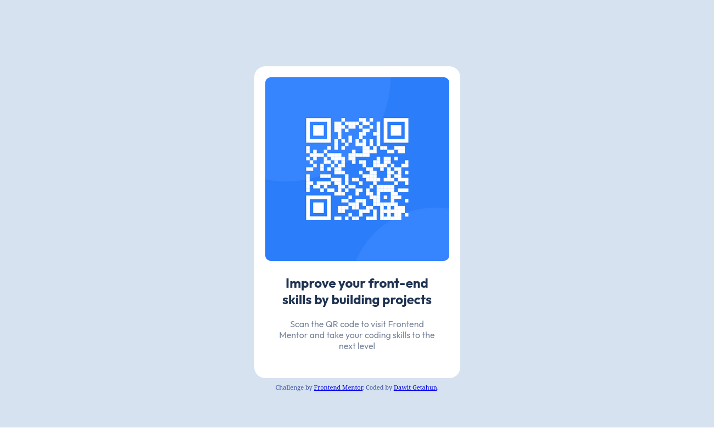
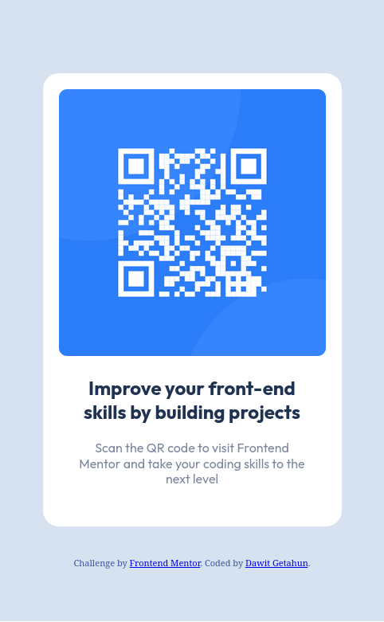

# Frontend Mentor - QR code component solution

This is a solution to the [QR code component challenge on Frontend Mentor](https://www.frontendmentor.io/challenges/qr-code-component-iux_sIO_H). Frontend Mentor challenges help you improve your coding skills by building realistic projects. 

## Table of contents

- [Overview](#overview)
  - [Screenshot](#screenshot)
  - [Links](#links)
- [My process](#my-process)
  - [Built with](#built-with)
  - [What I learned](#what-i-learned)
  - [Continued development](#continued-development)
  - [Useful resources](#useful-resources)
- [Author](#author)
- [Acknowledgments](#acknowledgments)

**Note: Delete this note and update the table of contents based on what sections you keep.**

## Overview

This project is a solution to the QR Code Component challenge from Frontend Mentor. The goal of this challenge was to build a QR code component that matches the provided design as closely as possible. The component is a simple yet essential part of many web applications, and this exercise aimed to hone my HTML and CSS skills by implementing it.

### Screenshot






### Links

- Solution URL: [solution url](https://github.com/dawitgetahun055/qr-code-component)
- Live Site URL: [Live site url](https://your-live-site-url.com)

## My process

1. Analyzing the design
2. Building the HTML structure
3. Styling With CSS
4. Adding Responsive Design
5. Testing and Refinement

### Built with

- Semantic HTML5 markup
- CSS custom properties
- Mobile-first workflow

### What I learned

In this project I avoided using the flex box to challenge my skill on how to position elements inside the containing element. And it was a little bit challenging. Especially when it comes to making it responsive.

```html
<body>

  <div class="container">
    
    <div class="qr-code">
      
    </div>

    <div class="note">
      <h2>Improve your front-end skills by building projects</h2>
      <p>Scan the QR code to visit Frontend Mentor and take your coding skills to the next level</p>
    </div>
  </div>


  
  <div class="attribution">
    Challenge by <a href="https://www.frontendmentor.io?ref=challenge" target="_blank">Frontend Mentor</a>. 
    Coded by <a href="#">Dawit Getahun</a>.
  </div>
</body>
```
```css
body {
    margin: 0;
    padding: 0;
    box-sizing: border-box;
    height: calc(569px + 12px + 200px);
    background-color: var(--Light-gray);
}

.container {
    width: 375px;
    height: fit-content;
    text-align: center;
    position: absolute;
    top: 50%;
    left: 50%;
    transform: translate(-50%, -50%);
    background-color: var(--White);
    border-radius: 20px;
    margin-top: 80px;
}
```

### Continued development

I've understood that I need to work on more projects and enhance my skills on positionining elements accurately. Therefor I will engage on such projects that will help me to do that in the future. 


### Useful resources

- [mozilla.org](https://www.mozilla.org) - Great resource for revisiting basic concepts, read documentations and where you can visually see the effects of  applied css styles.
- [freecodecamp](https://www.freecodecamp.com) - helps to learn by actively engaging on projects apart from FrontendMentor.

## Author

- Frontend Mentor - [@dawitgetahun055](https://www.frontendmentor.io/profile/dawitgetahun055)

- Dawit Getahun

## Acknowledgments

I'd like to thank [FrontendMentor] (https://www.frontendmentor.io) for providing this learning opportunity along with the assets and designs we need.

I'd also like to thank peers that helped me through my journey in learning front-end development.

I'd like to thank all the people who made this resources open for everyone.